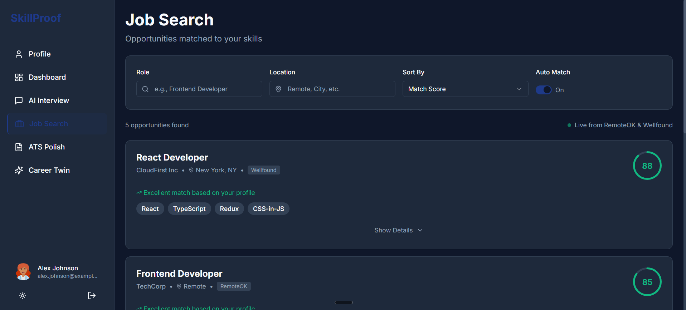
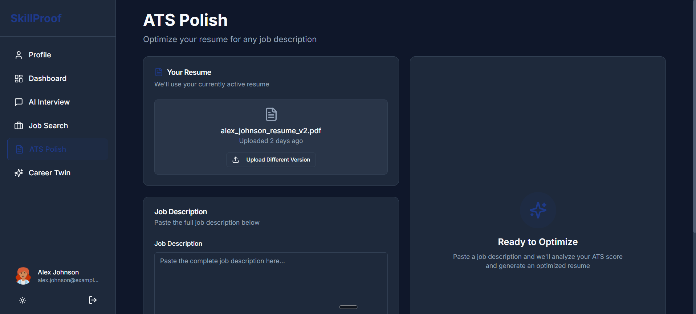

# 🚀 SkillProof: An AI-Ready Career Operating System for Students and Recruiters

> **Skills, Verified. Not Claimed.**  
> A dual-sided full-stack platform built for **Nerds Hack Days Lucknow**. Designed to bridge the gap between candidates and recruiters through AI-driven technical assessments, live recruiter invites, and automated skill validation powered by Google Gemini.

🔗 **Live Website:** [https://skillproof-fullstack-code.vercel.app/](https://skillproof-fullstack-code.vercel.app/)

---

## 📸 Platform Showcase

### 1. The Landing Page

*(Placeholder: Update with new Full-Stack Landing Page screenshot)*

### 2. Student Skill Dashboard
The centralized hub showing verified scores, skill breakdown, and real-time alerts for incoming recruiter interview requests.

*(Placeholder: Add screenshot showing the new Blue Pending Invite Banner)*

### 3. Live AI Interview IDE (Powered by Gemini)
An immersive testing environment where students solve real-world problems. Answers are submitted directly to the Node.js backend and rigorously evaluated in real-time by the Google Gemini AI.


### 4. Career Twin (AI Advisor)
Context-aware chatbot providing personalized career roadmaps and readiness checks based on the student's verified MongoDB profile.


### 5. Smart Job Search
Curated opportunities dynamically matched against the candidate's verified skills, complete with AI-generated match scores and missing skill gap analysis.


### 6. ATS Resume Polish
Instant, actionable feedback powered by Gemini to ensure your uploaded resume bypasses strict ATS filters against a target Job Description.


### 7. Recruiter Candidate Discovery & ATS
A powerful dashboard for recruiters to instantly discover pre-vetted talent, view GitHub stats, and manage **Live AI Interview Invites**.

*(Placeholder: Add screenshot of the new "Sent Invites" Tracker Tab showing Pending/Completed invites)*

---

## 📖 The Problem

The current tech hiring process is fundamentally broken for both sides of the table:

* **For Recruiters:** They are flooded with resumes full of self-reported, unverified skills. It is nearly impossible to tell who actually possesses the required technical abilities without conducting expensive and time-consuming manual interviews.
* **For Students:** 
  * **The Resume Black Hole:** Resumes are unfairly rejected by automated ATS systems due to poor formatting before a human ever sees them.
  * **No Way to Prove Skills:** Students have no standardized way to practice or prove their actual coding abilities to recruiters *before* landing an interview.
  * **Lack of Mentorship:** Freshers lack personalized guidance to know if their current skills are actually "industry-ready".

## 💡 Our Full-Stack Solution
**SkillProof** is a complete Career OS that replaces self-reported claims with hard data. We empower students to build a verifiable profile of their skills, and give recruiters an Applicant Tracking System to discover and evaluate pre-vetted talent effortlessly.

### For Students
1. **GitHub Integration:** Automatically sync repositories, languages, and commit history.
2. **AI Technical Interviews:** Take a mock technical interview directly on the platform. The Gemini AI evaluates the code in real-time and assigns a verified "SkillProof Score" stored securely in MongoDB.
3. **Career Twin Chatbot:** An AI career advisor that analyzes your current DB skills and compares them to target roles (e.g., "Am I Amazon ready?").
4. **ATS Polish:** Upload a resume PDF to get instant, actionable feedback to bypass strict ATS filters.

### For Recruiters
1. **Candidate Discovery:** Search the live database for candidates based on verified skills and minimum SkillProof scores.
2. **Live Interview Invites:** Request a Live AI Interview with a single click. Candidates receive a banner on their dashboard to accept and take the test.
3. **Invite Tracker:** A dedicated ATS tab to track pending invites and view the final, unedited AI grading feedback once the candidate completes the test.

---

## 🛠️ Tech Stack (MERN + AI)
This project is a fully integrated full-stack application built during the hackathon.

* **Frontend:** React.js, Tailwind CSS, Shadcn UI, React Query (Caching & State), React Router DOM.
* **Backend:** Node.js, Express.js.
* **Database:** MongoDB & Mongoose (Schemas for Users, Interviews, Job Caches, and Invites).
* **AI Engine:** Google Gemini API (Used for automated grading, resume parsing, job matching, and conversational advice).
* **Authentication:** Custom JWT-based Role Auth (Student vs. Recruiter) and GitHub profile linking.

---

## 🏃‍♂️ How to Run Locally

You will need two terminal windows to run both the frontend and the backend.

### 1. Database & Backend Setup
1. Clone the repository and open the `backend` folder:
   ```bash
   cd backend
   npm install
   ```
2. Create a `.env` file in the `backend` directory and add your credentials:
   ```env
   PORT=5000
   MONGO_URI=your_mongodb_connection_string
   JWT_SECRET=your_jwt_secret
   GEMINI_API_KEY=your_google_gemini_api_key
   ```
3. (Optional) Run the seed script to inject dummy students for recruiter testing:
   ```bash
   node backend/seed.js
   ```
4. Start the backend server:
   ```bash
   npm run dev
   ```

### 2. Frontend Setup
1. Open a new terminal and navigate to the `frontend` folder:
   ```bash
   cd frontend
   npm install
   ```
2. Start the React development server:
   ```bash
   npm start
   ```
   *The application will open automatically at http://localhost:3000*

---

## 🎯 Key Workflows to Test (For Judges)

1. **The Live Invite System:** Log in as a Recruiter, search for candidates, and click **Request Live AI Interview**. Switch to the **Sent Invites** tab to track it.
2. **Taking the AI Interview:** Log out and log in as the Student you just invited. You will see an alert banner on your dashboard. Accept the invite, take the Gemini-powered interview, and submit your code.
3. **Automated Grading Validation:** Log back in as the Recruiter, go to the Sent Invites tab, and witness the invite turn green. Click **View Full Result** to see the exact AI feedback stored in the database!
4. **Career Twin / ATS Scoring:** Test out the dynamic Gemini integrations by asking the Career Twin for advice or uploading a Job Description text in the ATS Polish module.

---
*Built with ❤️ for Nerds Hack Days, Lucknow.*
